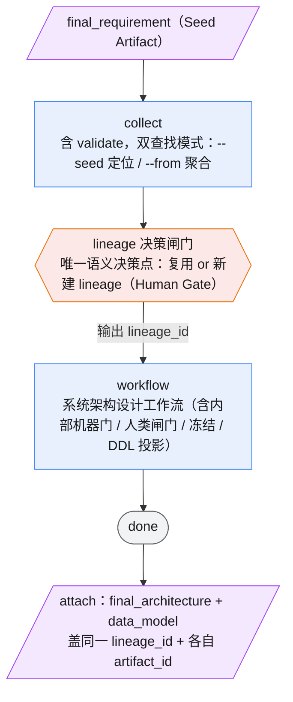

# architecture 命令

系统架构设计工作流 `system-architecture` 的专用命令。承接 `requirement-understanding` 产出的 Seed Artifact（final_requirement），产出 final_architecture + data_model 两个 Runtime Artifact。

**lineage 从本命令开始**——Architecture Command 是第一个 Runtime Artifact 的产出者，本命令的 human gate 是唯一 lineage 决策点（R13）。

## 语法

```text
/architecture [--seed <run_id>] [--from <lineage_id>] <goal...>
/architecture continue <run_id> [-f <clarification_file>]
/architecture reject <run_id>
/architecture status <run_id>
/architecture explain <run_id>
```

| 子命令 | 说明 |
|--------|------|
| `<goal>` | 启动架构设计运行（默认） |
| `continue <run_id> [-f <file>]` | architecture_review 人工审查后批准并继续，可指定裁决文件路径 |
| `reject <run_id>` | 拒绝并结束到 failed |
| `status <run_id>` | 查看运行状态 |
| `explain <run_id>` | 查看当前状态详情 |

| 参数 | 说明 |
|------|------|
| `--seed <run_id>` | 指定上游 requirement-understanding 的 run_id，collect 据此按 artifact_id 定位 Seed Artifact（final_requirement）。用于新 lineage 场景。 |
| `--from <lineage_id>` | 指定要修订的既有 lineage_id，collect 注入该 lineage 的历史 Runtime Artifact + 本次触发修订的 Seed Artifact。用于修订既有 lineage 场景（如 v1.1 的 M08 回显主小区）。 |
| `<goal>` | 架构设计目标描述。如含上游产物引用、技术约束、重点关注领域等。 |

`--seed` 与 `--from` 互斥。不指定任一参数时，collect 按 goal 中引用的文档路径推断上游。

## 运行（run）

### 启动

```powershell
python -m agent_workflow.cli run `
  -w workflows/system-architecture/workflow.yaml `
  -t '<topic>' `
  -g '<goal>'
```

### 流程概览

```text
collect（含 validate，双查找模式）
  ├─ 按 artifact_id 定位 Seed Artifact（--seed）
  └─ 按 lineage_id 聚合 Runtime Artifact（--from）
      ↓
[Human Gate: lineage 决策] ← 唯一语义决策点
  ├─ 识别需求隐含功能域（需求级聚类，不做架构分解）
  ├─ 功能域 → capability → 判断复用已有 lineage 还是新建
  ├─ 人确认/调整 lineage 决策
  └─ 输出 lineage_id（新建或复用）
      ↓
workflow
  gather_context → extract_drivers → structure_constraints_objectives
  → draft_architecture → evaluation_gate（LLM 机器门）
    revise  → conflict_revision → evaluation_gate
    approve → architecture_review（二元 Human Gate）⏸
      approve → architecture_freeze（应用人工裁决 + 冻结）
                → verdict_consistency_check → data_model → ddl_conflict_check → done
      reject  → failed
      ↓
attach
  ├─ final_architecture    ← lineage_id + artifact_id
  └─ data_model            ← 同一 lineage_id，独立 artifact_id
```



> 图例：🟦 确定性/执行节点（collect / workflow / attach）｜ 🟥 人类闸门（六边形，lineage 决策，⏸ 表示进程暂停等确认）｜ 🟪 产物（斜角框，Seed 输入 / attach 输出）｜ ⬜ 终态。workflow 内部的机器门（evaluation_gate）与人类闸门（architecture_review）细节见下方章节，此处折叠为单节点。

**两个独立 artifact，同一 lineage_id**（R2）：`final_architecture` 与 `data_model` 各自拥有独立的 `artifact_id = <run_id>:<artifact_name>`，共享同一 `lineage_id`。collect 下游按 lineage_id 聚合时二者都返回，靠 `artifact_name` 区分。

### lineage 决策闸门（human gate）

在 collect 完成、workflow 启动之前，Architecture Command 有一个**人类闸门**——这是整个 lineage 体系的唯一语义决策点：

1. **呈现**：collect 已聚合的上游产物摘要（Seed Artifact + 如有同 lineage 历史 Runtime Artifact）
2. **识别功能域**：从 final_requirement 中提取"需求隐含的独立功能域"（需求级聚类，**不是**架构分解——如"主小区治理""Agent/Skill""治理任务队列"）
3. **决策**：每个功能域是复用已有 lineage（修订既有能力）还是新建 lineage（全新能力）
4. **人确认**：人审视并拍板 lineage 决策，给出 lineage_id 列表

**关键约束**：
- 功能域是需求级聚类，不做架构分解（架构分解是 workflow 的事）
- "复用 vs 新建"是唯一需要人做的语义决策，其余全部确定性
- 禁止自动推断、自动分类、自动匹配 lineage
- 新 lineage_id 按业务能力命名（如 `master-community`），不按版本（不叫 `v1.1`）

> **两个不同的人类介入点，别混淆**：
> - **lineage 决策闸门**（本节，collect 之后 / workflow 之前）审的是"这份需求归到哪条 lineage"——**需求归属**，不看架构方案。
> - **architecture_review Human Gate**（workflow 内部，evaluation_gate 之后 / architecture_freeze 之前）审的是"架构方案本身好不好"——**方案质量**。见下方「Human Gate（architecture_review）」章节。

### goal 编写建议

goal 需包含足够信息供架构设计。建议包含：
- 上游 final_requirement 的路径（collect 注入用）
- 重点关注领域和约束
- 如 v1.1 是多 lineage 并行场景，说明各 lineage 独立运行 Architecture Command

多 lineage 并行的 v1.1 场景（§9.1）：新 lineage（主小区等）与修订既有 lineage（M08 回显主小区）是**两次独立的 Architecture Command 运行**——不同 run、不同 artifact、不同 lineage_id，human gate 一次只做一个决策。

## 完成后的产物

| 产物 | 说明 | Artifact 类型 |
|------|------|---------------|
| `final_architecture` | Architecture Freeze + ADR——系统上下文、组件职责、业务流程、ADR 记录 | Runtime（首个） |
| `data_model` | 确定性 DDL 投影——实体关系、新表 DDL、migration、索引设计 | Runtime（同 lineage） |
| `architecture_review` | Human Gate 架构方案审查意见 + 裁决文件模板（中间产物） | — |
| `project_analysis` | 项目上下文分析（中间产物，不进 lineage） | — |
| `architecture_drivers` | 架构驱动因素（中间产物） | — |

### attach：盖 Runtime Artifact 的 lineage_id + artifact_id

工作流到 `done` 后，给 `final_architecture` 和 `data_model` 分别盖 frontmatter：

```powershell
python scripts/attach.py `
  --file 'docs/runs/<run_id>/artifacts/final_architecture.md' `
  --lineage '<lineage_id>' `
  --artifact '<run_id>:final_architecture'

python scripts/attach.py `
  --file 'docs/runs/<run_id>/artifacts/data_model.md' `
  --lineage '<lineage_id>' `
  --artifact '<run_id>:data_model'
```

`attach.py` 幂等：重复盖同一 lineage_id + artifact_id 不产生重复条目。

## Human Gate（architecture_review，二元 approve/reject）

本工作流的 Human Gate 在 `architecture_review` 节点——**不是 lineage 决策**（那已由本命令的 lineage 闸门完成），而是**架构方案语义审查**（组件划分/驱动映射/约束覆盖/选型/集成/残留风险）。方案的机器打分已由上游 `evaluation_gate`（LLM 门）兜住。

工作流在 `architecture_review` 自动暂停（进程正常退出），等待人工通过 `continue`/`reject` 注入决策。

**对齐 module-breakdown / requirement-understanding 范式**：引擎 human gate 只支持二元 approve/reject。人工审查若发现需修订的问题，**不走 revise 回流**（引擎不支持），而是把修订指令写进裁决文件，由 `continue --input` 注入、architecture_freeze 应用后再冻结。

### 门暂停后的操作步骤

1. **确认状态**：`/architecture status <run_id>`、`/architecture explain <run_id>`

2. **查看审查产物**：`docs/runs/<run_id>/artifacts/architecture_review.md`（agent 的审查结论 + 裁决文件模板）、`architecture_draft.md`（被审方案）、`evaluation_report.md`（评估门结论）。

3. **准备人工裁决文件**（默认位置 `docs/runs/<run_id>/human_clarification.md`）：

   ```markdown
   # Human Clarification（架构方案裁决）

   ## 审查结论
   approve / reject

   ## 修订指令（若 approve 但需修订，逐条列出，architecture_freeze 应用）
   - <组件/决策>: <具体修订指令>

   ## 约束放宽审批（若评估门有 Relaxation Requests，逐条签字）
   - <放宽项>: 批准 / 驳回 + 理由
   ```

4. **批准并继续**：`/architecture continue <run_id>`（或 `-f <自定义路径>`）
   - 等价 `continue --approve --input <file>`；工作流从 architecture_freeze 应用裁决 + 冻结 → verdict_consistency_check → data_model → ddl_conflict_check → done。

5. **或拒绝**：`/architecture reject <run_id>`（等价 `continue --reject` → failed）。

### continue / reject 命令详情

```powershell
# 批准（应用裁决文件中的修订指令后冻结）
python -m agent_workflow.cli continue `
  -r <run_id> -w workflows/system-architecture/workflow.yaml `
  --approve --input <clarification_file>

# 拒绝
python -m agent_workflow.cli continue `
  -r <run_id> -w workflows/system-architecture/workflow.yaml --reject
```

裁决文件查找优先级：`-f` 指定 → `docs/runs/<run_id>/human_clarification.md`（默认）。文件不存在不自动创建，提示后询问。`reject` 前须向用户确认。

## 状态与诊断

### 查看状态

```text
/architecture status <run_id>
```

等价于：

```powershell
python -m agent_workflow.cli status -r <run_id>
```

### 查看详情

```text
/architecture explain <run_id>
```

等价于：

```powershell
python -m agent_workflow.cli explain -r <run_id>
```

## 目录结构

```
docs/runs/<YYMMDD_<topic>>/
├── artifacts/
│   ├── project_analysis.md
│   ├── architecture_drivers.md
│   ├── constraints_objectives.md
│   ├── architecture_draft.md
│   ├── evaluation_report.md
│   ├── conflict_revision_doc.md         ← 仅在有 revise 循环时
│   ├── architecture_review.md           ← Human Gate 审查意见 + 裁决模板
│   ├── final_architecture.md            ← Runtime Artifact（有 lineage_id）
│   └── data_model.md                    ← Runtime Artifact（同 lineage_id）
├── human_clarification.md               ← 人工裁决文件（continue --input 注入）
└── workflow_state.json
```

## 与其他命令的关系

```text
PRD → /req-understand → final_requirement（Seed Artifact，仅 artifact_id）
                              ↓
        /architecture ← lineage 从本跳开始（Runtime Protocol: collect → [gate] → workflow → attach）
                              ↓
        /module-breakdown（propagate 同 lineage）
                              ↓
        spec-dev（以模块定义为 goal）
```

## 执行规则

1. 使用 **PowerShell** 工具执行命令，工作目录为**项目根目录**（当前仓库根，即本 `.claude/` 所在目录）。
2. Python 用 `python`（需先激活项目所用的 conda base 环境，Python 3.11+），不写死绝对路径。
3. 所有参数用单引号包裹，防止特殊字符被 PowerShell 解析。
4. goal 文本较长时优先使用 **Bash** 工具而非 PowerShell，避免中文编码问题。
5. **运行到 `architecture_review` 会自动暂停**（进程正常退出），此时向用户呈现审查产物并引导 continue/reject，不要误判为失败。
6. **`continue` 前必须检查裁决文件是否存在**；不存在时提示路径和格式，不自动创建。裁决文件默认写入 `docs/runs/<run_id>/human_clarification.md`，不使用项目根目录。
7. **`reject` 前必须向用户确认**（"将拒绝并结束运行，进入 failed 状态，确认？y/n"）。
8. 不要自动执行 `cancel` 或 `retry --dispatch`，除非用户显式确认。
9. 不要读取、打印或外传 `.env`、密钥、数据库凭证等敏感内容。
10. 工作流到 `done` 后执行 attach 给 final_architecture + data_model 盖 lineage_id + artifact_id；**中间产物不 attach、不带 frontmatter**。
11. 运行结束时，报告最终状态（done / failed）并提示产物路径。
12. **多 lineage 并行**：每条 lineage 独立运行一次 Architecture Command，不在同一运行里挤多个 lineage 决策。
