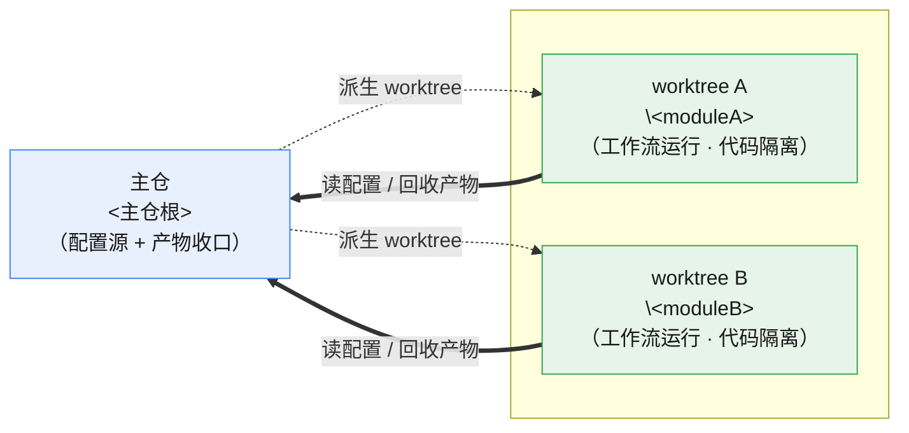

# spec-wt 命令

在**独立 git worktree** 中运行 `spec-dev` 工作流，实现并行开发时的代码物理隔离。

适用场景：把项目拆成多个模块、想同时跑多个 `spec-dev` run 各自实现一个模块，又不希望它们在同一个工作目录里互相覆盖代码。

## 为什么需要 worktree

`agent-workflow` 引擎单 run 内部串行，但**多个并行 run 共享同一个工作树时没有文件隔离**——不同 run 的 execution 节点会同时往同一份代码写，互相覆盖。worktree 给每个 run 一个独立工作目录 + 独立分支，开发期物理隔离，冲突推迟到合并阶段由 git 处理。

引擎约束（已验证）：`project_root` 在 run 启动时定死，**无法在工作流节点间中途切换**。所以隔离必须在 run 启动**之前**由本命令完成，不能做成工作流内的节点。

## 语法

```text
/spec-wt -t <module> [-b <branch>] [--lineage <lineage_id>] [--seed <run_id>] <goal...>
```

| 参数 | 说明 |
|------|------|
| `-t <module>` | **必填**。模块名，用于 worktree 目录名、分支名、topic 命名 |
| `-b <branch>` | 可选。分支名，省略时默认 `feat/<module>` |
| `--lineage <lineage_id>` | 可选。指定 lineage_id，启动前通过 collect 注入同链上游产物（module_breakdown + final_architecture + data_model）到 goal。省略时行为不变——goal 直接透传 |
| `--seed <run_id>` | 可选。配合 `--lineage` 使用，指定 requirement-understanding 的 run_id，collect 一并将 Seed Artifact（final_requirement）注入。单独使用无效 |
| `<goal>` | 要实现的目标描述 |

示例：

```text
/spec-wt -t alert-center 实现告警中心页面
/spec-wt -t audit-log -b feat/audit 实现审计日志查询
/spec-wt -t master-community --lineage master-community-governance --seed 260707_prd_v11 实现主小区主数据 CRUD 接口
```

## 路径约定

> 下表用占位符描述路径，执行时按本机实际取值替换（不要写死某台机器的盘符/用户名）：
> - `<主仓根>`：当前仓库根目录，用 `git rev-parse --show-toplevel` 获取（本 `.claude/` 的上级）。
> - `<worktree根>`：存放各 worktree 的父目录，约定与主仓**同卷**（便于硬链接/合并）。默认取主仓同级的 `lm-wt`（即 `<主仓根>` 的父目录下的 `lm-wt`）；也可由用户指定。

| 项 | 取值 |
|----|------|
| 主仓 | `<主仓根>` |
| worktree 目录 | `<worktree根>\<module>`（与主仓同卷，便于硬链接/合并） |
| 分支 | `-b` 指定值，或默认 `feat/<module>` |
| 基线分支 | 当前主仓所在分支（用 `git -C <主仓根> rev-parse --abbrev-ref HEAD` 获取） |

## 执行步骤

### 1. 解析参数

1. 提取 `-t` 后的值为 `<module>`。**缺失时报错并停止**："请用 -t 指定模块名"。
2. 提取 `-b` 后的值为 `<branch>`，省略则 `<branch> = feat/<module>`。
3. 提取 `--lineage` 后的值为 `<lineage_id>`（可选）。
4. 提取 `--seed` 后的值为 `<seed_run_id>`（可选，仅当 `--lineage` 存在时有效）。
5. 剩余 token 拼接为 `<goal>`。缺失时询问："请描述要实现的目标"。
6. 计算 `<wt_path> = <worktree根>\<module>`。

### 2. 预检查

```powershell
# 主仓必须干净或至少基线分支可用；检查 worktree 目录与分支是否已存在
git -C <主仓根> worktree list
git -C <主仓根> branch --list '<branch>'
```

- 若 `<wt_path>` 已在 worktree 列表中：提示"该模块 worktree 已存在，是否复用并继续？"，复用则跳到第 4 步。
- 若 `<branch>` 已存在但不在 worktree 中：提示用户选择换分支名或删除旧分支，**不自动删除**。

### 3. 创建 worktree + 分支

```powershell
git -C <主仓根> worktree add '<worktree根>\<module>' -b '<branch>'
```

失败（如分支已存在、目录非空）则报告错误并停止，**不强制覆盖**。

### 3a. 写入 worktree 映射

为「会话丢失后凭 run 数据找回 worktree 和分支」提供持久化依据。映射以 **module 名**为 key（而非精确 run_id——因 run_id 可能带 `_v1`/`_v2` 后缀，但 module 段始终不变），写入主仓 `docs/worktree_map.json`：

```powershell
$mapFile = '<主仓根>\docs\worktree_map.json'
$map = @{}
if (Test-Path $mapFile) {
  try { $map = Get-Content $mapFile -Raw | ConvertFrom-Json -AsHashtable } catch { $map = @{} }
}
$map['<module>'] = @{
  worktree = '<worktree根>\<module>'
  branch   = '<branch>'
  created  = (Get-Date -Format 'yyyy-MM-dd HH:mm:ss')
}
# ConvertTo-Json 对嵌套对象需注意 depth
$map | ConvertTo-Json -Depth 3 | Out-File $mapFile -Encoding utf8 -NoNewline
Write-Output "[*] 已写入 worktree 映射: <module> → <branch> @ <worktree根>\<module>"
```

待 run 启动后从 stdout 提取实际 run_id，在该 module 条目下补充 `run_id` 字段（可选，便于精确查找；不补充也不影响恢复——靠 module 名匹配即可）。

### 4. 注入 agent 命令环境变量（仅占位符版 agents.yaml 需要）

> **先判断本步是否需要**：看主仓 `workflows/spec-dev/agents.yaml` 的 `command` 字段。
> - 若是直接命令（如 `cc-opus`/`codex`）→ 引擎拿到非占位符值直接用，不查 `.env`/环境变量，**本步整段跳过**。
> - 若是 `{OPUS_COMMAND}` 之类占位符 → 才需要下面的注入。

worktree 是 gitignore 过滤后的副本，**不含 `.env`**。占位符版引擎 agent 启动时从 `project_root/.env` 读 `{OPUS_COMMAND}` 等占位符——worktree 里读不到会导致 agent 起不来。

解法：把主仓 `.env` 里的 **3 个 agent 命令变量**读出、注入当前 PowerShell 会话（`os.environ` 优先级高于 `.env` 文件，引擎会优先用它）。**只注入命令变量，不注入数据库变量**——这样 validation 节点的 DB 集成测试会自动 skip（已确认可接受），也避免并行 run 的集成测试争抢同一个库。

```powershell
# 从主仓 .env 注入 agent 命令变量到当前会话
$envFile = '<主仓根>\.env'
if (Test-Path $envFile) {
  Get-Content $envFile | Where-Object { $_ -match '^(OPUS_COMMAND|DEEPSEEK_COMMAND|CODEX_COMMAND)=' } | ForEach-Object {
    $k,$v = ($_ -split '=',2)
    Set-Item "env:$($k.Trim())" $v.Trim().Trim('"').Trim("'")
  }
}
```

> 注：本步是否需要只取决于 `agents.yaml` 的 `command` 写法，与是否用 `agents.tmp.yaml` 无关。当前主仓 `agents.yaml` 已是直接命令（`cc-opus`/`cc-deepseek`/`codex`，保留个人 wrapper），**默认无需注入，本步跳过**。另两条免注入路径：① 启动时加 `--agents <主仓根>\workflows\spec-dev\agents.tmp.yaml`（命令写死为 `claude`/`codex`，开箱即用但丢失个人 wrapper）；② 把 `agents.yaml` 改回 `{OPUS_COMMAND}` 占位符版时，才需回到上面的注入步骤。

### 5. 注入 lineage 上下文（可选）

> **仅当 `--lineage` 参数存在时执行本步，否则整步跳过。**

当用户通过 `--lineage` 指定了 lineage_id 时，本步通过 `collect.py` 聚合同链上游产物，将产物路径与摘要拼入 goal。这样 spec-dev 的 planning 节点无需自行翻找静态文档即可看到完整的需求→架构→模块上下文（R9：切断静态井）。

```powershell
# 构造 collect 命令
$collectArgs = @(
  'scripts/collect.py',
  '--lineage', '<lineage_id>'
)
if (<seed_run_id>) {
  $collectArgs += @('--seed', '<seed_run_id>:final_requirement')
}
$collectOutput = & python $collectArgs
```

将 collect 输出拼入 goal 头部。**必须用 PowerShell here-string 存入 `$goal` 变量**——collect 输出含架构/需求文档全文，内有 `>`、`|`、`&`、`**`、`[[]]` 等字符，一旦字面拼进命令行会被 shell 当重定向/管道执行（曾在主仓根目录溅出一批空文件，见执行规则第 3 条）：

```powershell
# collect 输出已在上一步存于 $collectOutput（变量承载，不进命令行）
$goal = @"
$collectOutput

## 本次任务目标

<原始 goal>
"@
```

> 无 `--lineage` 时本步跳过，goal 直接存变量：`$goal = @'`<换行>`<原始 goal>`<换行>`'@`（单引号 here-string 不做变量展开，最安全）。

**约束**：
- `--lineage` 缺失时整步跳过，goal 原样透传，与当前行为零差异
- collect 失败（如 lineage_id 不存在、无匹配产物）→ 报告警告但不阻断，继续以原始 goal 启动。理由：lineage 是上下文增强，不是前置条件；普通任务不依赖 lineage 也能正常运行
- `--seed` 仅与 `--lineage` 配合时有效；单独传 `--seed` 忽略

### 6. 启动 spec-dev

关键参数：
- `-w` 用**主仓绝对路径**：agents/skills 配置从主仓单一来源发现，不受 worktree 内副本漂移影响。
- `-p` 指向 **worktree**：agent 工作目录落在 worktree，代码改动隔离于此。
- `--run-root` 收口到**主仓**：产物统一存放，run_index 好查，不散落在各 worktree。

```powershell
# 强制 UTF-8，避免 goal 内中文按 GBK 解码成乱码（Windows PowerShell 默认编码坑）
[Console]::OutputEncoding = [System.Text.Encoding]::UTF8
$env:PYTHONUTF8 = '1'

# 关键：-g 后直接跟 $goal 变量（不加引号、不做字面展开）。
# PowerShell 将 $goal 作为单个 argv 传给子进程，其中的 > | & 等永不进 shell 解析。
# 若 <module> 也含特殊字符，同样用变量 $module 承载。
python -m agent_workflow.cli run `
  -w '<主仓根>\workflows\spec-dev\workflow.yaml' `
  -p '<worktree根>\<module>' `
  --run-root '<主仓根>\docs\runs' `
  -t '<module>' `
  -g $goal
```

> ⚠️ **绝不可**写成 `-g '<goal>'` 再把 collect 输出字面粘进去——含 `>` 的文档行（如 AGENTS.md 的 `correctness > security > ...`）会被 PowerShell 当重定向，在当前目录创建一批空文件。goal 必须始终以变量传递。

`run` 是阻塞命令。spec-dev 全链跑 30~90 分钟，远超 AI 助手后台工具的超时上限（后台最大 10 分钟）。**但工具超时到点只是停止跟踪、向 AI 返回，并不会杀掉引擎 `Popen` 出去的进程树**——`run` 主进程与 agent 子进程作为脱离进程继续在后台跑到完（已实测：run 挂后台跑满 50 分钟正常推进，见记忆 `long-workflow-launch-detached.md`）。因此：

- 挂后台跑即可，**收到工具超时返回≠工作流死了**，别据此 kill 进程或重启。
- 之后靠 `status -r <run_id>` / `heartbeat.json` 时间戳 / `log -r <run_id>` 判活与取进度；启动瞬间 stdout 的 `[START] Workflow 启动: <run_id>` 即含 run_id。
- 拿到 run_id 后补写 `docs/worktree_map.json` 该 module 条目的 `run_id` 字段（见第 3a 步）。

### 7. 处理结果

若阻塞等到了 `run` 返回，直接从退出码判定；若工具中途超时返回（进程仍在后台跑），则**从 `docs/runs/<run_id>/workflow_state.json` 的终态判定**：

| 退出码 | 终态字段 | 含义 | 处理 |
|--------|---------|------|------|
| 0 | `done` | done | 进入「成功指引」 |
| 1 | `failed` | failed | 进入「失败指引」，**保留 worktree** |
| 2 | `cancelled` | cancelled | 报告取消，**保留 worktree** |

#### 成功指引（退出码 0）

代码已在 worktree 的工作区完成，但 **spec-dev 工作流全程不执行 git commit**——改动以未提交状态留在 worktree，`<branch>` 分支上没有本次 run 的提交。因此合并前**必须先在 worktree 里手动 commit**，否则 `git merge <branch>` 合不到任何东西。

展示指引（**commit / merge / remove 均不自动执行**，由用户确认时机，避免并行 run 同时写主分支引发冲突）：

```
=== spec-wt 完成 ===
模块: <module>
worktree: <worktree根>\<module>
分支: <branch>
run_id: <run_id>
产物: docs/runs/<run_id>/

下一步（请在确认无误后手动执行）：
  # 1. 先在 worktree 把改动提交到 feat 分支（工作流不自动 commit）
  git -C <worktree根>\<module> add -A
  git -C <worktree根>\<module> status            # 提交前核对改动范围
  git -C <worktree根>\<module> commit -m '<模块>: <简述>（run <run_id>）'

  # 2. 回主仓合并、清理
  cd <主仓根>
  git merge <branch>          # 或先开 PR 评审
  git worktree remove <worktree根>\<module>   # 合并后清理
  git branch -d <branch>
```

#### 失败指引（退出码 1）

**不要删除 worktree**——重试依赖它。展示：

```
=== spec-wt 失败 ===
run_id: <run_id>
worktree 已保留: <worktree根>\<module>（请勿删除，重试需要）

重试（从中断节点续跑）：
  python -m agent_workflow.cli retry -r <run_id> --dispatch `
    -w '<主仓根>\workflows\spec-dev\workflow.yaml'
```

> 参数说明（引擎已修复 retry 的 project_root 恢复逻辑）：
> - **`-p` 不用带**：retry 会从快照恢复 `project_root`（原 run 跑在 worktree，就续在同一 worktree）。引擎已修正旧缺陷——以前不带 `-p` 会降级成当前目录 `"."`，现在正确回退到快照值。
> - **`--run-root` 在主仓目录里敲可省**：找 run 靠当前目录下的 `docs/runs` / `run_index.json`，主仓能直接定位。若在主仓之外的目录敲，才需补 `--run-root '<主仓根>\docs\runs'`。
> - **`-w` 仍需显式指主仓**：dispatch 用快照里的 `project_root`（= worktree）去搜 `workflow.yaml`，会搜到 worktree 那份，而其同目录的 `agents.yaml` 被 gitignore 过滤、worktree 里不存在 → 会 fallback 到 mock agent（产物空壳）。`-w` 指向主仓 `workflow.yaml`，agents/skills 才从主仓单一来源发现。这是「agents.yaml 只放主仓」设计的固有约束，非缺陷。

## 执行规则

1. 使用 **PowerShell** 工具执行所有命令；Python 用 `python`（需先激活项目所用的 conda base 环境，Python 3.11+），不写死绝对路径。
2. 所有 `git` 命令对主仓用 `git -C <主仓根>`，避免依赖当前目录；`<主仓根>`/`<worktree根>` 为占位符，执行时按本机实际路径替换（取值见「路径约定」），不要写死某台机器的盘符/用户名。
3. **参数传递铁律**：`<module>`、`<branch>`、路径等短参数用单引号包裹；**`<goal>` 必须用 PowerShell 变量 `$goal`（here-string 承载）传给 `-g`，绝不字面拼进命令行**。goal 经 `--lineage` collect 注入后含架构/需求文档全文，内有 `>`/`|`/`&`/`**`/`[[]]` 等字符，字面入命令行会被 shell 当重定向/管道执行——曾于 2026-07-15 在主仓根目录溅出 16 个空文件（`security`/`traceability`/... 对应 AGENTS.md 的 `correctness > security > ...` 行）。启动前设 `[Console]::OutputEncoding=UTF8` + `$env:PYTHONUTF8='1'` 防中文乱码。
4. **绝不自动执行的动作**（需用户显式确认）：`git merge`、`git worktree remove`、`git branch -d`、`retry --dispatch`、任何 `--force`。
5. **失败/取消的 run，其 worktree 必须保留**，不主动清理。
6. 不读取、打印或外传 `.env` 的值；第 4 步只把命令变量注入会话，不回显其值。
7. 多个模块并行时：**每个模块单独一次 `/spec-wt` 调用**，各自独立 worktree；合并回主分支由用户串行手动执行，避免并行写 main。
8. validation 节点在 worktree 中运行：DB 集成测试因缺 `PGSQL_*` 环境变量自动 skip（`go test` 仍计为通过），纯单元测试正常执行。
9. `--lineage` 参数为可选：存在时执行 collect 注入上游产物；缺失时 goal 原样透传，行为与之前零差异。
10. collect 失败不阻断启动：lineage 是上下文增强而非前置条件，失败时报告警告、以原始 goal 继续。

## 清理与接手

### worktree 清理在哪、何时

清理只在「成功指引」里作为**手动**步骤出现（`git worktree remove`），且受执行规则约束：属「绝不自动执行」项（需用户确认），失败/取消的 run 其 worktree 必须保留。换言之，工作流本身从不清理 worktree，全部由用户在合并确认后手动执行。

### 清理失败怎么办

`git worktree remove` 失败通常三种原因：

| 原因 | 现象 | 处理 |
|------|------|------|
| 工作区有未提交改动/未跟踪文件 | 提示 `contains modified or untracked files` | 先确认改动去留：要保留就先 commit/合并；确认可丢弃再 `git worktree remove --force`（force 属需确认项，不自动执行） |
| 进程占用目录 | `Permission denied` / 目录被锁 | 关掉占用该目录的进程（编辑器、终端、跑测试的 shell）后重试 |
| 目录已手删但登记残留 | `worktree list` 仍显示该项 | `git -C <主仓根> worktree prune` 清理登记 |

### agent 或人工接手完成工作怎么办

适用场景：工作流失败/卡死/产物不达标，由 agent 或人工接手把模块做完。**关键约束（因 spec-dev 不自动 commit）**：

1. **改动只留在 worktree 的 feat 分支**——不要跑到主仓 `<主仓根>` 直接改。否则破坏隔离，且该 worktree 一旦被 `retry` 续跑，会与主仓分叉、互相覆盖。
2. **接手完成后在 worktree 手动 commit**（工作流不会替你提交）：
   ```powershell
   git -C <worktree根>\<module> add -A
   git -C <worktree根>\<module> commit -m '<模块>: 人工/agent 接手完成（run <run_id>）'
   ```
3. **在 `docs/runs/<run_id>/` 留一行说明**该 run 由接手完成、非工作流产出，避免 run 记录与实际代码对不上（traceability 断裂）。
4. 之后才走「成功指引」的合并清理：`git merge` → `git worktree remove` → `git branch -d`。
5. 若原 run 已处于 failed 且被多次 retry/误操作污染，worktree 又无有效提交，优先**废弃重建**（删分支、删 worktree、重新 `/spec-wt`），不要在脏基础上接手。

### 会话丢失后恢复 worktree / 分支

如果 Claude 会话丢失，凭 `docs/runs/<run_id>/` 内的 run 数据即可找回对应的 worktree 和分支。

**恢复链路**：

1. **从 run_id 取 module 名**：run_id 格式为 `YYMMDD_<module>`（如 `260626_M10b-wecom-notify`），module 段即 `-t` 传入的值。
2. **查 `docs/worktree_map.json`**（第 3a 步写入的映射）：
   ```powershell
   Get-Content '<主仓根>\docs\worktree_map.json' | ConvertFrom-Json
   ```
   以 module 名为 key 拿到 `worktree`（路径）和 `branch`（分支名）。若条目里有 `run_id` 字段则可精确匹配。
3. **若 worktree 目录还在**：直接从 `git -C <worktree> rev-parse --abbrev-ref HEAD` 确认分支无误，然后正常 retry 或接手。
4. **若 worktree 目录已被删除但分支还在**：从映射文件拿到 branch 名，在主仓 `git -C <主仓根> branch --list '<branch>'` 确认，然后按需重建 worktree 或直接在主仓操作该分支。
5. **若两者均被删除**：仅凭 run 数据无法恢复——worktree 和分支的磁盘状态是唯一实物，`worktree_map.json` 只是索引，不留实物则索引也失效。

**注意**：`worktree_map.json` 与 `run_index.json` 同在主仓 `docs/` 下，均被 `.gitignore` 排除出版本库（本地状态文件）。换机器后需重新生成；同一机器上只要 `docs/` 目录不手动清理，映射会一直保留。

## 相关工作流

| 工作流 | 文件 | 说明 |
|--------|------|------|
| spec-dev | workflows/spec-dev/workflow.yaml | 需求驱动开发链：plan → review → execute → audit → test → summary |

## 目录关系示意图

一句话：**一个主仓派生出多个并存的 worktree**（每个模块各一个、各跑一个 run），`run` 的三个参数**故意三向分流**——配置向主仓收（单一来源不漂移）、代码向各自 worktree 隔离（并行 run 不互撞）、产物向主仓收口（好查不散落）。下图左侧是主仓（配置源 + 产物收口），右侧是两个同时存在的 worktree，各自的 `run` 都跑在自己的 wt 目录，但产物统一回收到主仓。



> 图例：🟦 主仓（配置单一来源 + 产物收口）｜ 🟩 worktree（工作流运行处、代码隔离，可并存多个）｜ 虚线 `-.->` = 主仓派生 worktree ｜ 粗实线 `==>` = worktree 读主仓配置、产物回收主仓。

### 运行时落点表（谁在哪跑、谁落在哪）

| 运行时行为 | 落在哪个目录 | 由什么决定 |
|-----------|-------------|-----------|
| 引擎读 workflow.yaml / agents.yaml / skills 配置 | **主仓** `<主仓根>` | `-w` + 「配置只放主仓」约定 |
| agent 进程工作目录（cwd）、`project_root` | **worktree** `<worktree根>\<module>` | `-p`（run 启动时定死，中途不可切） |
| 代码改动（execution 节点写文件） | **worktree** | `-p`（隔离于此，故并行不互撞） |
| run 产物 / `workflow_state.json` / `heartbeat.json` | **主仓** `docs/runs/<run_id>/` | `--run-root`（收口，不散落各 worktree） |
| worktree↔分支映射索引 | **主仓** `docs/worktree_map.json` | 命令第 3a 步写入 |

关键点：worktree 只承载**代码工作区**，是 gitignore 过滤后的副本（读不到 `.env`、`agents.yaml`），所以配置一律回主仓单一来源发现；产物则统一收口到主仓 `docs/runs`，即使 worktree 被清理，run 记录与产物仍留在主仓。`spec-dev` 全程不 commit，改动以未提交态留在 worktree 分支，合并前需先在 worktree 手动 commit（见「成功指引」）。
