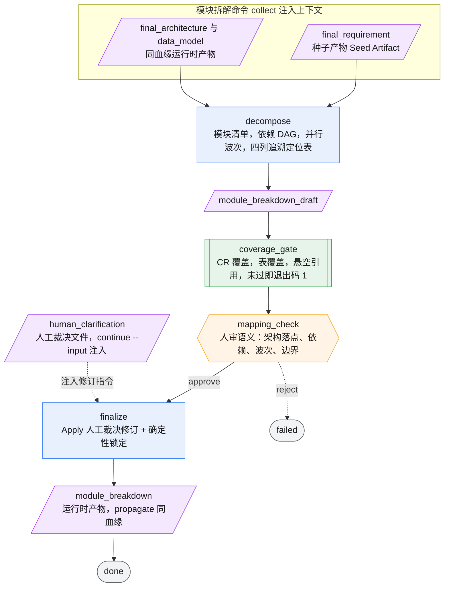

> 前半为工作流介绍（定位 / 问题 / 结构 / 设计决策 / 边界），适合评审与汇报；
> 后半「操作查阅」为运行、产物、衔接与验证的手册。

# module-breakdown

把已冻结的系统架构与数据模型，拆解为**可并行开发、可追溯、架构一变就知道哪些模块要改**的模块定义的工作流。

它的核心洞察有两条：

1. **拆模块的价值不在"分了几块"，在"怎么并行、改一处牵动哪几块"。** 真正被沉淀的核心资产是依赖有向无环图（DAG）、并行波次，以及一张四列追溯定位表（模块 → 需求 / 架构 / 数据表 / 验收标准）——它让"架构改了一处，哪些模块要跟着改"变成可查表，而不是靠记忆。
2. **拆解只做拆解，不回头做架构决策。** 输入是上游已冻结的架构和数据模型，本工作流只负责把它们切成可交付单元，不重新讨论组件该不该这么分、字段该不该有。

这个工作流由模块拆解命令（Module Breakdown Command）驱动，消费同一血缘（lineage）的 `final_architecture` + `data_model` + 种子产物 `final_requirement`，产出带同血缘标识的运行时产物 `module_breakdown`。

---

## 解决什么问题

从架构到开发任务这一步，常见的失控方式有四种：

1. **模块拆完就开工，才发现漏了需求或漏了表。** 某条 CR、某张表没有任何模块承接，等开发排到才暴露，返工重排。
2. **人肉核对覆盖，最容易看花眼。** "34 条 CR 是不是都分到模块了""每张表有没有归属"——这类机械核对交给人做，越核越困、越困越漏。
3. **依赖画错、波次排错，并行开发撞车。** 同一波的两个模块其实互相依赖，或对同一张表并发写，开工后才发现顺序不对。
4. **架构一变，不知道哪些模块受影响。** 缺少模块与架构/需求/表的映射，一次架构调整只能靠人回忆去逐个模块排查。

这个工作流分别用：确定性覆盖门、机械核对交给脚本、人审聚焦语义、四列追溯定位表 —— 来正面应对这四点。

---

## 工作流结构（先脚本兜覆盖，再人审语义）

一条主链，无回流。关键编排是：**确定性覆盖门排在人审之前**，先把机械完整性卡死，人审只需聚焦机器判不了的语义。人工裁决是二元 `approve / reject`（对齐引擎 Human Gate 只支持 approve/reject 的范式）；审查若发现需修订的问题，修订意见写进人工裁决文件、经 `continue --input` 注入，由 `finalize` 读取并应用——不再有独立的 revise/refine 回流节点。



> 图例：🟦 模型节点 ｜ 🟧 人工裁决门（六边形，二元 approve/reject）｜ 🟩 确定性脚本门（双线框）｜ 🟪 产物（斜角框）｜ ⬜ 终态。确定性覆盖门排在人工门之前——先卡机械完整性，人审只碰语义。修订意见经人工裁决文件（`human_clarification`）注入，由 `finalize` 应用，无独立修订回流节点。

### 各节点职责

| 阶段 | 节点 | 产出 | 职责与边界 |
|------|------|------|-----------|
| 拆解 | `decompose` | `module_breakdown_draft` | 基于注入的架构+数据模型+需求，切成可独立开发/测试/交付的模块：模块清单、依赖 DAG、并行波次、四列追溯定位表。**只拆解，不做架构决策、不写代码、不排开发计划。** |
| **确定性门** | `coverage_gate` | `coverage_report` | 脚本门（非大模型）：门1 每条 CR 都被某模块 `covers_cr` 覆盖；门2 每张表都被某模块 `covers_table` 覆盖；门3 无悬空引用（引用了不存在的 CR/表）。有未覆盖或悬空即退出码 1。 |
| 人审门 ★ | `mapping_check` | `mapping_review` | 全流程**唯一的人类裁决点**（二元 gate）。只审脚本管不了的语义：架构落点对应、依赖 DAG 合理性、并行波次无写冲突、模块边界内聚、覆盖映射是否语义正确（而非仅编号挂靠）。裁决 `approve / reject`——approve 进 finalize（需修订则把意见写进人工裁决文件供 finalize 应用），reject 终止。**不重复核对覆盖计数，不新增模块。** |
| 锁定 | `finalize` | `module_breakdown` | 确定性投影：读取经 `continue --input` 注入的人工裁决文件（`human_clarification`），逐条应用其中"模块 ID → 修订指令"，再锁定模块定义。输出锁定版清单/DAG/波次/四列追溯定位表 + 关键路径 + 模块间契约草案 + 审计追踪。**只 Apply 裁决 + 锁定，不做新拆解、不做架构决策。** |

---

## 关键设计决策（价值所在）

四个选择，决定了这份模块定义"可并行、可追溯"而非"看起来分好了":

**1. 确定性覆盖门排在人审前面，机械完整性先卡死。**
"34 条 CR 是否都分到模块""每张表有无归属"这类核对，是人肉最易看花眼、也最不该由人做的事。所以在人审之前先放一道纯脚本门：连接键是 CR 编号与表名（机器稳定标识符），逐项集合比对，漏一条就退出码 1、工作流失败。人审拿到的一定是"覆盖已过关"的草稿。

**2. 覆盖门故意不用大模型。**
如果让模型来判"覆盖全不全"，它会和拆解侧的盲点重合——拆解时漏看的 CR，判覆盖时它同样看不见，反而给出虚假的全覆盖。所以 `coverage_gate` 是纯脚本、与拆解侧正交。**机器兜机器兜得住的，人只兜机器兜不住的。**（与 requirement-understanding 的覆盖校验、system-architecture 的两道脚本门同源思想。）

**3. 全局只有一个人类裁决点，且只审语义。**
人不核对覆盖计数（那是脚本的事），只审脚本判不了的四件事：模块有没有正确落到架构组件上、依赖关系和数据流一致吗、同波模块会不会撞车、模块边界内不内聚。**人的注意力集中在语义质量上，不浪费在机器能做的核对上。**

**4. 四列追溯定位表是核心交付物，不是附属文档。**
模块 → 需求(CR) → 架构组件 → 数据表 → 验收标准(AC)的四列映射，是"架构一变就知道哪些模块要改"的那张表。它让下游变更影响分析从"靠人回忆"变成"查表",也是覆盖门能机械比对的前提。

**5. finalize 是确定性锁定，不是又一轮拆解——修订经裁决文件注入而非回流节点。**
引擎的 Human Gate 只支持二元 `approve / reject`，无 revise 回流。所以 `mapping_check` 若发现需修订的问题，不走独立的修订节点回环，而是把"模块 ID → 修订指令"写进人工裁决文件（`human_clarification`），经 `continue --input` 注入；`finalize` 读取并逐条应用后再锁定（与 requirement-understanding 的 `canonicalize` 同范式）。锁定节点只把裁决通过的结果固化成最终产物——应用裁决修订、分配状态标记(新增/修订/复用)、补关键路径和模块间契约,没有自由度。它不重新拆分、不做架构判断、不新增未经审查的模块。**人审之后只 Apply 不 Reason**,保证最终产物和人审结论一致。

---

## 边界（不做什么）

- 只做模块拆解，**不做架构决策**（那是 system-architecture 的事）、**不写代码、不排具体开发计划**（那是 spec-dev 的事）。
- 人审的是拆解的语义质量（架构落点/依赖/波次/边界），不是架构决策；如对架构本身有异议，应回到架构阶段而非在此修改。
- 修订只能基于 `mapping_review` 的具体问题（经人工裁决文件注入、由 `finalize` 应用），不能自由发挥、不能新增未经审查的模块。
- 产物**不含实现进度标记**（勾选/🟡/🟠）——进度归 `00-implementation-status.md`。
- 模块 ID 一旦锁定，后续演进（evolution）通过 `supersedes` / `splits-into` / `merges-from` 追踪变更，不直接改写。

---
---

## 操作查阅

以下为运行、产物、衔接与验证的手册。

### 运行

由模块拆解命令统一驱动（不使用裸 `agent-workflow run`），按 `collect → workflow → attach` 运行。collect 注入同血缘的 `final_architecture` + `data_model` 和种子产物 `final_requirement`；工作流出品 `module_breakdown`（运行时产物，propagate 同一 lineage_id）。

### 主要产物

| 产物 | 来源节点 | 类型 | 作用 |
|------|----------|------|------|
| `module_breakdown_draft` | `decompose` | 中间产物 | 模块清单、依赖 DAG、并行波次、四列追溯定位表（草稿） |
| `coverage_report` | `coverage_gate` | 中间产物 | CR 覆盖 / 表覆盖 / 悬空引用的确定性校验报告 |
| `mapping_review` | `mapping_check` | 中间产物 | 人审意见（架构落点/依赖/波次/边界），含每条问题的模块 ID 定位 + 人工裁决文件模板 |
| `module_breakdown` | `finalize` | **运行时** | 锁定版模块定义：清单/DAG/波次/四列追溯定位表/关键路径/模块间契约（同血缘标识） |

### 与其他工作流衔接

```text
/req-understand → final_requirement（种子产物）
      ↓
/architecture → final_architecture + data_model（运行时产物，血缘诞生）
      ↓
/module-breakdown → module_breakdown（运行时产物，propagate 血缘）
      ↓
spec-dev（以模块定义为 goal，逐模块开发）
```

### 验证

```powershell
$env:PYTHONPATH='src;.'
python -m agent_workflow.cli validate-config -w workflows\module-breakdown\workflow.yaml
python -m agent_workflow.cli validate-state-machine -w workflows\module-breakdown\workflow.yaml

# 覆盖门脚本单测
python workflows\module-breakdown\command\test_mapping_check.py
```
