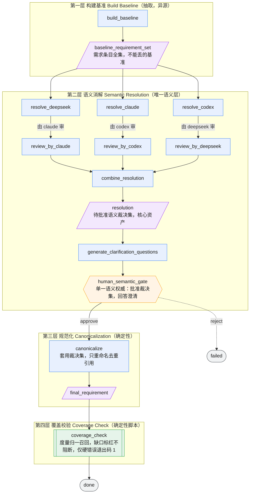

# requirement-understanding

把一份原始 PRD，收敛成**可追踪、可澄清、可确定性重放**的规范化需求（Canonical Requirement）的工作流。

它的核心洞察是一次重新框定（reframe）：**需求是视图（View），不是终点**。

真正被沉淀下来、可追责的资产不是最后那份需求文档，而是两样东西——`baseline_requirement_set`（抽取到的需求条目全集，作为"不能丢"的基准）和 `resolution`（哪些条目是同一对象、可合并、可派生的语义裁决集）。最终的 `final_requirement` 只是把裁决集机械地套用到基准上、投影出来的一个视图。基准变了、裁决变了，视图就能确定性地重放出来，而不是靠人再读一遍 PRD 重写。

---

## 解决什么问题

需求理解这一步，传统做法有三个反复出现的坑：

1. **多人/多模型各写一版，口径对不齐。** 每个人读同一份 PRD，产出的理解措辞、颗粒度、取舍都不同，最后靠开会碰或谁声音大来定，分歧被抹平而不是被记录。
2. **需求悄悄丢项，没人能证明没丢。** 从 PRD 到需求文档到设计，每一跳都可能漏掉一条字段约束或一条规则，等到开发或验收才发现，且无法回溯是哪一步丢的。
3. **"这两条是不是一回事""要不要合并"全靠拍脑袋。** 等价、合并、派生这类语义判断散落在各人脑子里，没有单一裁决点，也没有证据链，事后无从追溯当初为什么这么并。

这个工作流把上述三点分别对应到：多模型独立提议 + 异源互检、确定性覆盖（Coverage）门、单一人类语义裁决点。

---

## 工作流结构（语义先于机械）

四层，前一层的产出是后一层的唯一输入。语义判断全部收敛在第二层，第三、四层只做机械操作、不再引入新判断。



> 图例：🟦 模型节点 ｜ 🟧 人工裁决门（六边形）｜ 🟩 确定性脚本门（双线框）｜ 🟪 产物（斜角框）｜ ⬜ 终态。

### 每层职责

| 层 | 节点 | 输入 | 产出 | 职责与边界 |
|----|------|------|------|-----------|
| **L1 抽取** | `build_baseline` | goal + project_context | `baseline_requirement_set` | 尽力（best-effort）抽全需求条目，作为"不能丢"的基准（召回率 Recall 的分母）。**只抽取，不做等价/合并判断。** 硬约束：与第二层异源，否则会和第二层共享盲点造成虚假 100%。 |
| **L2 语义** | 3× `resolve_*` → 3× `review_by_*` → `combine_resolution` → `generate_clarification_questions` | baseline + goal | `resolution`、`clarification_questions` | **唯一允许做语义判断的层。** 多模型独立提出"哪些是同一对象/可合并/派生"，异源互检，合并为一份待批准裁决集，并就分歧生成澄清问题。 |
| **L2 裁决** | `human_semantic_gate` ★ | resolution + 澄清问题 | 暂停，等人工 `continue` 注入裁决 | 全流程**唯一的人类语义权威**。批准/否决每条合并与派生关系、回答澄清。派生关系必须逐条签字（覆盖校验兜不住派生）。 |
| **L3 归一** | `canonicalize` | baseline + 已批准 resolution + 人工裁决 | `final_requirement` | 确定性机械层：把批准后的裁决集套用到基准上，重命名/去重/分配编号/回指。**只套用不推理（Apply not Reason）**，发现新关系要退回第二层而非私自决定。 |
| **L4 校验** | `coverage_check` | baseline + resolution + final | `coverage_report` | 确定性脚本看板（非大模型）：经裁决集解析后比对，度量 `final_requirement` 对基准项的归一召回。**未追溯的基准项与断言蒸发只标红进报告、供人工裁量，不阻断（退出码 0）**；仅产物缺失/机读块缺失等硬错误才退出码 1 使工作流失败。 |

---

## 关键设计决策（价值所在）

四个反直觉的选择，也是这个工作流区别于"让一个模型读一遍 PRD 写份文档"的地方：

**1. 多模型独立提议 + 异源互检，而不是投票。**
三个模型各自读基准、互不参考地提出语义关系，再交叉审查（A 的提议由 B 审）。目的不是"少数服从多数"——一致性分数（`consensus_score`）已被降级，不再是通过依据。分歧不被抹平，而是被标红为保真度（Fidelity）风险，交给人裁决。多源在这里的作用是相互成为**独立见证**，暴露单模型的盲点。

**2. 覆盖校验用确定性脚本，故意不用大模型。**
覆盖率校验如果也交给模型判断，它会和第二层的盲点重合——模型漏看的项，它自己也检不出来，反而给出虚假的 100%。所以第四层是一段纯 Python 脚本，靠机读锚点做集合比对，把未追溯项标红进报告供人工裁量（不阻断），只有产物/机读块缺失这类硬错误才非零退出。**机器算机器算得清的（召回度量），人裁机器裁不了的（缺口是否可接受）。**

**3. 全局只有一个人类语义裁决点。**
所有需要人拍板的判断——等价、合并、派生、澄清——全部收敛到 `human_semantic_gate` 这一个门。人不需要逐条审基准全集，也不审整份需求，只审"被提议合并/派生的这些关系对不对"，并配有 `Source → Merged` 证据。**人的注意力是最稀缺的，把它集中花在机器判不了的语义分歧上。**

**4. 覆盖校验只证"归一召回"，绝不越界声称"PRD 没漏"。**
这个门证明的是第三层没丢第一层已发现的项（归一召回 Canonicalization Recall），**不**证明第一层抽全了 PRD（那是抽取召回 Extraction Recall，靠多轮/异源/人工抽检逼近）。边界写死在设计里，避免拿"覆盖校验亮绿"当"需求没漏"的挡箭牌——这是一种诚实，而非能力不足。

---

## 边界（不做什么）

- 只规范化需求，**不输出技术选型、架构建议或实现计划**。
- **不产血缘（lineage）**（血缘从架构阶段开始），产物是纯 markdown，不盖 lineage_id / artifact_id。
- `final_requirement` **不含实现进度标记**（勾选/🟡/待 Mxx 等）——单一事实来源（SoT）只讲系统"该怎样"，不讲"做到哪了"，进度归 `00-implementation-status.md`。
- 通过依据是**人类裁决门批准 + 覆盖校验无硬错误**（未追溯项标红供人工裁量、不阻断通过），不是模型间的一致性分数。

---
---

## 操作查阅

以下为运行、暂停恢复与验证的命令手册。

### 运行

```powershell
$env:PYTHONPATH='src;.'
python -m agent_workflow.cli run `
  -w workflows\requirement-understanding\workflow.yaml `
  -g "<产品运营需求>"
```

真实运行时会自动发现同目录的 `agents.yaml`、`skills/` 和 `mock_script.yaml`。

> **首次使用需准备 `agents.yaml`**：引擎只加载 `agents.yaml`（已被 `.gitignore` 忽略、不入库）。
> 入库的是模板 `agents.example.yaml`（通用 `claude`/`codex` 命令）。首次克隆后复制一份：
> `cp agents.example.yaml agents.yaml`，按需把 `command` 改成个人 wrapper（如 `cc-opus`/`cc-deepseek`）。
> 缺 `agents.yaml` 会导致引擎读不到 agent 配置。

### 暂停与恢复

工作流执行到 `human_semantic_gate` 后暂停，状态保存在 `workflow_state.json`。

```powershell
python -m agent_workflow.cli status -r <run_id>
python -m agent_workflow.cli explain -r <run_id>
```

根据 `clarification_questions` 与待批准的 Resolution 提议写一份人工裁决文件 `human_clarification.md`（含澄清回答 + 对每条 Divergent/Derived Relation 的批准/否决，派生关系必须逐条签字），然后：

```powershell
python -m agent_workflow.cli continue `
  -r <run_id> `
  -w workflows\requirement-understanding\workflow.yaml `
  --approve `
  --input human_clarification.md
```

拒绝并结束到 `failed`：

```powershell
python -m agent_workflow.cli continue -r <run_id> -w workflows\requirement-understanding\workflow.yaml --reject
```

### 主要产物

| Artifact | 来源节点 | 作用 |
|----------|----------|------|
| `baseline_requirement_set` | `build_baseline` | Layer1 best-effort 抽取的需求条目全集（Recall 分母，非 Ground Truth） |
| `resolution_proposal_deepseek/claude/codex` | `resolve_*` | Layer2 三模型独立 Resolution 提议 |
| `review_claude/codex/deepseek` | `review_by_*` | 异源盲区校验（独立见证） |
| `resolution` | `combine_resolution` | Layer2 合并后的待批准 Resolution（核心资产） |
| `clarification_questions` | `generate_clarification_questions` | 面向用户的澄清问题 |
| `human_clarification_request` | `human_semantic_gate` | 暂停前的裁决请求（澄清 + Resolution 提议 + Evidence） |
| `human_clarification` | `continue --input` | 用户澄清回答 + 对 Resolution 的裁决 |
| `final_requirement` | `canonicalize` | Layer3 Apply(Resolution) 的 Canonical Requirement View |
| `coverage_report` | `coverage_check` | Layer4 归一召回报告（缺口标红供人工裁量、不阻断，仅硬错误退出码 1） |

### 机读锚点约定

产物嵌入 fenced block 供 `coverage_check.py` 机读（详见 `command/coverage_check.py` 头注释）：

- `baseline_requirement_set.md`：` ```coverage baseline ` — 每项 `id`(R-*) / `token` / `assertions`
- `final_requirement.md`：
  - ` ```coverage canonical ` — 每项 `id`(CANON-*/CR-*) / **`sources`(连接键，必需)** / `anchor`(可选语义标签) / `assertions`(多行块列表)
  - ` ```coverage exclude ` — 裁决移出范围项：每项 `id`(R-*) / `reason`
- `resolution.md`：` ```coverage resolution ` — 每条 `type` / `from`(源 baseline id) / `to`(可选语义标签，**不作连接键**)

连接键是 canonical 项的 `sources` 字段（回指 baseline id 的机器稳定标识符），不是 resolution 的 `to` 锚点——LLM 自由命名的锚点跨节点不共享标识符，恒断裂，已弃用该路径。assertions 只做警告级比对，门只阻断 id 级 Recall。

### 验证

```powershell
# 工作流校验
$env:PYTHONPATH='src;.'
python -m agent_workflow.cli validate-config -w workflows\requirement-understanding\workflow.yaml
python -m agent_workflow.cli validate-state-machine -w workflows\requirement-understanding\workflow.yaml

# Coverage Check 脚本单测
python workflows\requirement-understanding\command\test_coverage_check.py
```
