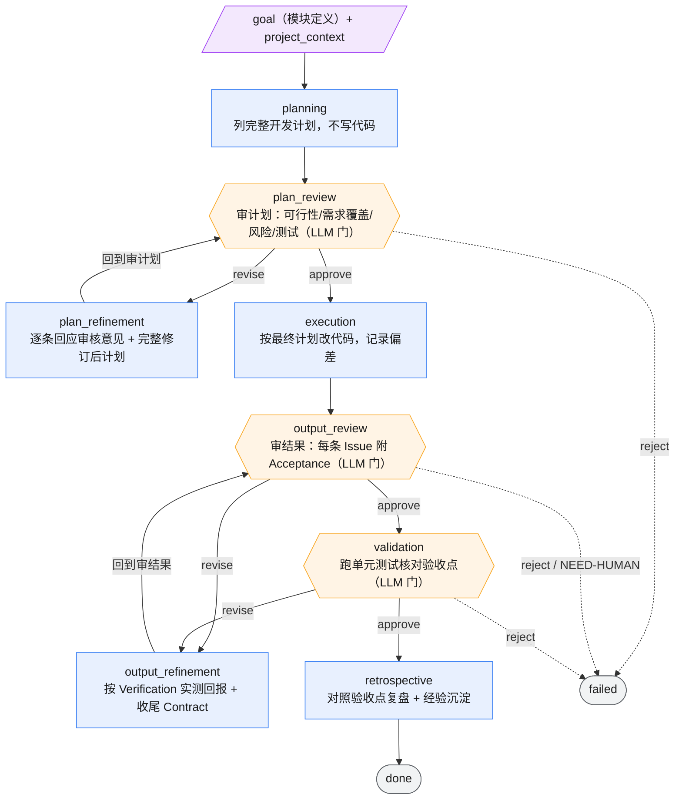

# spec-dev

把一个**模块定义**（goal），转化为**经过审查、可验证、闭环收敛**的代码实现的工作流。

它的核心洞察有两条：

1. **review 与 refine 不是自由对话，是一份有验收标准的协议。** 审查者提出的每条问题都必须携带 Acceptance（"什么时候算修好了"），修订者据此闭环并回报验证结果。没有验收标准的往返，会退化成"改一个、又挑一个"的无限拉扯——审查永远能再找到一处不满意，循环停不下来。
2. **条件回流，而非固定轮次。** 审查通过就前进，有问题才回流修订；小任务一轮即过，难任务按需多轮。轮次由质量决定，不由流程写死，避免简单改动被迫陪跑多轮审查。

---

## 解决什么问题

需求驱动的开发这一步，传统做法有四个反复出现的坑：

1. **review/refine 空转，撞上限才停。** 审查每轮都能挑出新的不满意点，修订每轮都改一点，谁也说不清"到底什么时候算好"，最后靠 `max_visits` 硬上限强行终止，而非真正收敛。
2. **refine 声称修好，review 一验就打回。** 修订者说"已修复 gofmt"，实际没跑 `gofmt -l`；下一轮审查一验发现没修好，白白多耗一轮。"修好了"的判据由修订者随口定义，不可信。
3. **修复过程留下污染。** 为修一个问题临时建的脚本、跑测试生成的 `coverage.out` / `bin/` 没清理，或顺手改坏了不相关文件——下一轮审查把这些当成新的交付偏离，又一次打回。
4. **小任务被迫多轮陪跑。** 固定"双轮审查"式流程让一个改三行的任务也要走满既定轮次，把审查预算浪费在不需要的地方。

这个工作流分别用：Issue 契约（Acceptance 为核心）、refine 收尾 Contract（改完必须按验证手段实测并回报）、临时产物清理 + `git diff` 越界检查、条件回流（不固定轮次，`max_visits` 只作失控保险）——来正面应对这四点。

---

## 工作流结构（条件回流 + 验收协议）

八个节点，两段结构相同的"执行 → 审查 →（按需）修订"条件回流：计划段与产出段。审查类节点输出 `approve / revise / reject` 驱动状态机，执行/修订类节点输出 `done / fail / blocked`。



> 图例：🟦 执行/修订节点（输出 done/fail/blocked）｜ 🟧 审查门（六边形，LLM 裁决 approve/revise/reject）｜ 🟪 输入产物（斜角框）｜ ⬜ 终态。`max_visits=3` 限制同一 state 进入次数，是防回流失控的保险，不是正常收敛路径。

### 各节点职责

| 阶段 | 节点 | 产出 | 职责与边界 |
|------|------|------|-----------|
| 列计划 | `planning` | `plan_doc` | 阅读需求，列需求理解/目标非目标/文件边界/分步方案/测试策略/风险停止规则/交付清单。**只列计划，不写实现代码。** |
| 审计划 ★ | `plan_review` | `plan_review_doc` | 审计划质量：Blocking 缺陷、需求覆盖、主要风险、缺失测试、可简化点。有上一轮则核对修订方向是否处理。**只审不改。** |
| 修计划 | `plan_refinement` | `plan_refinement_doc` | 逐条回应审核意见（采纳/延后/不采纳 + 理由）+ 完整修订后计划。**采纳阶段不写代码。** |
| 执行 | `execution` | `execution_report` | 按最终计划改代码，改动紧凑、贴合项目风格，记录实际修改文件/命令/与计划偏差。计划不成立则 `blocked`。 |
| 审结果 ★ | `output_review` | `output_review_doc` | 审代码变更。**每条 Issue 强制附 `Severity + Acceptance（必填）+ Verification（可选）`**；Acceptance 决定 Done，Verification 只是证明。判 `approve/revise/reject`，UNVERIFIABLE 的 Blocking 走 NEED-HUMAN。**只审不改。** |
| 修结果 | `output_refinement` | `output_refinement_doc` | 逐条回应并按每条 Issue 的 Verification **实际执行验证**，回报四状态（PASS/FAIL/NOT_EXECUTED/UNVERIFIABLE）。宣布 done 前过收尾 Contract（见下）。 |
| 验证 ★ | `validation` | `test_report` | 以单元测试为核心手段核对需求验收点。测试失败 `revise` 回修结果；无法运行须写明原因与剩余风险。 |
| 复盘 | `retrospective` | `summary_report` | 对照需求验收点逐项说明达成、关键决策链路、修改文件清单、测试结果、残余风险、经验沉淀。 |

---

## 关键设计决策（价值所在）

六个选择，决定了这个工作流"能收敛"而非"靠上限强停"：

**1. Issue 契约的核心是 Acceptance，不是 Verification。**
审查者提的每条问题都必须写清"什么时候算修好了"（Acceptance），这是决定 Done 的唯一判据。Verification（可执行命令）只是证明手段，是可选的——命名误导、README/注释不一致、违反分层这类设计/文档问题给不出命令，但同样是真问题，同样要给 Acceptance（如"README 更新并反映当前行为"，Verification 写 `Manual Review`）。**若把 Verification 设成 revise 的准入门，审查就会退化成"只认跑得出命令的问题"，丢掉发现设计缺陷的能力。**

**2. refine 收尾 Contract：改完必须按验证手段实测并回报。**
修订者宣布 `done` 前必须逐项留痕：所有 Blocking 已处理；每条已采纳修复按其 Verification **实际执行**并回报 PASS/FAIL/NOT_EXECUTED/UNVERIFIABLE 四状态；跑 `git status` + `git diff` 确认无意外新增、无越界改动；本轮临时产物已清理。**"修好了"不再由修订者随口声称——有可执行手段却没执行，就是 NOT_EXECUTED，不是 PASS。** 这一条直接掐掉"声称修好、审查打回"的空转。

**3. `git diff` 而非只看 `git status`。**
`git status` 只能发现新增/残留文件，发现不了"顺手改坏一个不相关文件"这类副作用。收尾 Contract 两者都查：status 堵残留，diff 堵越界。**很多污染不是多了个文件，而是悄悄改了不该改的行。**

**4. 允许删"本轮产生的临时产物"，而非"本轮创建的文件"。**
修订者可以删除本轮执行过程中产生的临时产物——不仅是自己手写的一次性脚本，也包括 `coverage.out`、`.pytest_cache`、`bin/`、`build/` 等工具运行生成物（这些不是谁"创建"的，但同样该清）。仍然禁止删用户文件、既有代码库文件、其他轮次的产出。**按"产物来源"授权比按"谁创建"授权覆盖得更干净。**

**5. UNVERIFIABLE 交人工，不靠猜测放行。**
当某 Blocking 的 Acceptance 因环境限制无法验证（如无 PG16 跑不了 migration 集成测试），审查不得靠猜 approve，而是在报告顶部醒目标注 `⚠️ NEED-HUMAN` + 恢复指引，决策 `reject` 交人工裁决（补齐环境 `retry` 续跑，或人工验收后推进）。**机器验不了的，老实交给人，而不是假装验过了。**

**6. 条件回流，`max_visits` 只作保险。**
不用固定双轮展开——审查 approve 就前进，revise 才回流。小任务一轮即过，难任务按需多轮，轮次由质量而非流程决定。`max_visits=3` 是防回流失控的安全阀，它触发意味着**收敛失败**（该去查协议为何没闭环），而不是正常的终止路径。

---

## 边界（不做什么）

- 工作流产出代码改动与文档产物，**不 commit、不 merge、不清理 worktree**——这些均由用户手动确认后执行。
- worktree 隔离须在 run 启动**前**完成，工作流内无法切换 `project_root`。
- 审查门（`plan_review` / `output_review` / `validation`）**只审不改**；修订指令由 refinement / execution 节点执行。
- refinement 不得扩大到计划外重构，不覆盖用户未要求修改的工作，不删本轮产物之外的文件。
- UNVERIFIABLE 的 Blocking **不在工作流内闭环**，走 NEED-HUMAN 交人工，工作流本身不提供 gate 暂停（当前复用 `failed` 终态 + 显式标记）。
- 失败/取消的 run **保留 worktree** 供重试；`git merge` / `worktree remove` / `branch -d` / `retry --dispatch` / `--force` 均不自动执行。

---
---

## 操作查阅

以下为运行、worktree 隔离、重试、清理与验证的手册。

### 运行

```powershell
python -m agent_workflow.cli run `
  -w workflows\spec-dev\workflow.yaml `
  -g "<开发目标>"
```

真实运行会自动发现同目录的 `agents.yaml`、`skills/` 和 `mock_script.yaml`。

> **agents 配置两份**：`agents.yaml`（本地未跟踪，命令可用个人 wrapper 如 `cc-opus`，被 gitignore）与 `agents.example.yaml`（纳入版本库，命令写死 `claude`/`codex`，开箱即用）。不带 `--agents` 时默认发现 `agents.yaml`。

### 主要产物

| Artifact | 来源节点 | 作用 |
|----------|----------|------|
| `plan_doc` | `planning` | 开发计划 |
| `plan_review_doc` | `plan_review` | 计划审核意见 |
| `plan_refinement_doc` | `plan_refinement` | 计划修订与逐条回应 |
| `execution_report` | `execution` | 实际改动文件、命令、与计划偏差 |
| `output_review_doc` | `output_review` | 执行结果审核意见（每条 Issue 附 Acceptance） |
| `output_refinement_doc` | `output_refinement` | 结果修订、四状态验证回报、收尾 Contract 核对 |
| `test_report` | `validation` | 单元测试结果与剩余风险 |
| `summary_report` | `retrospective` | 最终总结与复盘 |

### worktree 隔离运行

并行跑多个 spec-dev run（各做一个模块）时，**多个 run 共享同一工作树没有文件隔离**——不同 run 的 execution 节点会同时往同一份代码写、互相覆盖。解法是给每个 run 一个独立 git worktree + 独立分支，开发期物理隔离，冲突推迟到合并阶段由 git 处理。

引擎约束（已验证）：`project_root` 在 run 启动时定死，**无法在工作流节点间中途切换**。所以隔离必须在 run 启动**之前**完成，不能做成工作流内的节点。项目封装了 `/spec-dev-wt` 命令自动完成（详见 `.claude/commands/spec-wt.md`），本节说明其底层机制。

#### 路径约定

| 项 | 取值 |
|----|------|
| 主仓 | `F:\listing-management` |
| worktree 目录 | `F:\lm-wt\<module>`（与主仓同卷，便于合并） |
| 分支 | `feat/<module>`（默认） |
| run 产物 | `F:\listing-management\docs\runs\<run_id>\`（收口到主仓，不散落 worktree） |

#### 启动（关键参数语义）

```powershell
git -C F:\listing-management worktree add 'F:\lm-wt\<module>' -b 'feat/<module>'

python -m agent_workflow.cli run `
  -w 'F:\listing-management\workflows\spec-dev\workflow.yaml' `
  -p 'F:\lm-wt\<module>' `
  --run-root 'F:\listing-management\docs\runs' `
  -t '<module>' -g '<goal>'
```

- **`-w` 用主仓路径**：agents/skills 配置从主仓单一来源发现，不受 worktree 内副本漂移影响。引擎读 agents 配置的锚点是 `-w` 同目录，与 worktree 无关——即使 `agents.yaml` 被 gitignore、worktree 里没有，也照常从主仓读到。
- **`-p` 指 worktree**：agent 执行目录（`cwd`）落在 worktree，代码改动隔离于此。`project_root` 也是引擎找 `.env` 的锚点。
- **`--run-root` 收口主仓**：产物统一存放、`run_index` 好查。

#### .env 与命令占位符

worktree 是 gitignore 过滤后的副本，**不含 `.env`**。

- 若 `agents.yaml` 的 `command` 是**直接命令**（如 `cc-opus`）→ 引擎直接用，不查 `.env`/环境变量，无需任何额外处理。
- 若是 **`{OPUS_COMMAND}` 占位符** → 引擎从 `project_root/.env`（= worktree，没有）或 `os.environ` 解析。此时需把主仓 `.env` 的命令变量注入当前会话（`os.environ` 优先级高于 `.env`）。

#### 重试

```powershell
python -m agent_workflow.cli retry -r <run_id> --dispatch `
  -w 'F:\listing-management\workflows\spec-dev\workflow.yaml'
```

- **`-p` 不用带**：retry 从快照恢复 `project_root`，原 run 跑在 worktree 就续在同一 worktree。
- **`--run-root` 在主仓目录里敲可省**：找 run 靠 cwd 下的 `docs/runs` / `run_index.json`；在主仓之外敲才需补。
- **`-w` 仍需指主仓**：dispatch 用快照 `project_root`（= worktree）搜 `workflow.yaml`，会搜到 worktree 那份，而其同目录 `agents.yaml` 被 gitignore 不存在 → fallback 到 mock agent（产物空壳）。`-w` 指主仓才能让 agents 从主仓发现。这是「agents.yaml 只放主仓」设计的固有约束，非缺陷。
- **UNVERIFIABLE 场景续跑**：`output_review` 因环境限制标 NEED-HUMAN 走到 `failed` 时，补齐环境（如起 PG16）后用 retry 续跑，让验证真正执行。

#### 清理

清理只在合并确认后**手动**执行，工作流本身从不清理；失败/取消的 run 其 worktree 必须保留（重试依赖它）。

```powershell
cd F:\listing-management
git merge feat/<module>
git worktree remove F:\lm-wt\<module>
git branch -d feat/<module>
```

`git worktree remove` 失败的处理：

| 原因 | 现象 | 处理 |
|------|------|------|
| 有未提交改动/未跟踪文件 | `contains modified or untracked files` | 先确认去留：保留就先 commit；确认可丢弃再 `--force` |
| 进程占用目录 | `Permission denied` / 目录被锁 | 关掉占用进程（编辑器、终端、跑测试的 shell）后重试 |
| 目录已手删但登记残留 | `worktree list` 仍显示 | `git -C F:\listing-management worktree prune` |

#### ⚠️ 工作流不自动 commit —— 接手与合并须知

**spec-dev 全程只改文件、写 report，不执行任何 git commit。** 即便工作流跑到 `done`，改动也只是 worktree 工作区的**未提交状态**，feat 分支上没有本次 run 的提交。因此：

1. **合并前必须先在 worktree 手动 commit**，否则 `git merge` 合不到东西：
   ```powershell
   git -C F:\lm-wt\<module> add -A
   git -C F:\lm-wt\<module> status        # 提交前核对范围
   git -C F:\lm-wt\<module> commit -m '<module>: <简述>（run <run_id>）'
   ```
2. **agent/人工接手**（工作流失败、卡死、产物不达标时把模块做完）：
   - 改动只留在 worktree 的 feat 分支，**不要跑到主仓直接改**——否则破坏隔离，且该 worktree 被 retry 续跑时会与主仓分叉、互相覆盖。
   - 接手完成后按上面方式手动 commit。
   - 在 `docs/runs/<run_id>/` 留一行说明该 run 由接手完成、非工作流产出，避免 run 记录与实际代码对不上。
   - 若原 run 已 failed 且被多次 retry/误操作污染、worktree 又无有效提交，优先**废弃重建**（删分支、删 worktree、重新启动），不要在脏基础上接手。
3. **会话丢失后恢复**：凭 `docs/runs/<run_id>/` 内的 run 数据即可找回 worktree 和分支：
   - run_id 的 module 段（`YYMMDD_<module>` 中 `<module>` 部分）对应 `-t` 传入的模块名。
   - 查 `docs/worktree_map.json`（spec-wt 启动时自动写入的映射文件）拿到 `worktree` 路径和 `branch` 名。
   - worktree 目录还在 → 直接重试/接手；目录已删但分支还在 → 从映射拿分支名，按需重建。
   - 详见 `.claude/commands/spec-wt.md`「会话丢失后恢复」节。

#### 并行注意

- 每个模块单独一次启动，各自独立 worktree。
- 合并回主分支由用户**串行手动**执行，避免并行写 main 引发冲突。
- validation 节点在 worktree 运行：DB 集成测试因缺 `PGSQL_*` 环境变量自动 skip（`go test` 仍计为通过），纯单元测试正常执行。

### 验证

```powershell
python -m agent_workflow.cli validate-config -w workflows\spec-dev\workflow.yaml
python -m agent_workflow.cli validate-state-machine -w workflows\spec-dev\workflow.yaml
```
