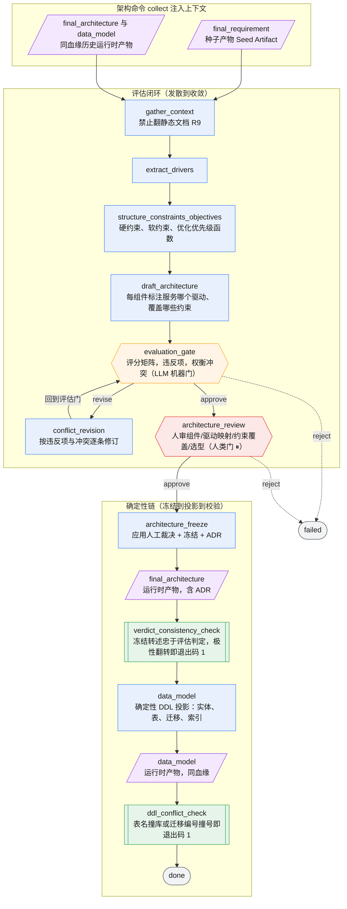

# system-architecture（血缘感知 lineage-aware / v2）

把一份已澄清的规范化需求，转化为**可审查、可追溯、可冻结**的系统架构方案（含数据模型）的工作流。

它的核心洞察有两条：

1. **架构不是一次写成的，是被约束逼出来的。** 好方案不靠灵感，靠把"感觉合理"翻译成一组可评分的硬约束（Hard Constraints）与软约束（Soft Constraints），再让方案逐条对齐、被独立评估、按冲突修订，直到过关。
2. **需求是上下文（Context），原始 PRD 是证据（Evidence）。** 架构师读的是上游产出的规范化需求（作为单一事实来源 SoT），而不是回头再翻一遍原始 PRD——原始文档只在需要人工追溯时才回查。

这个工作流由架构命令（Architecture Command，`/architecture`）驱动，按运行时协议 `collect → [人工门：血缘] → workflow → attach` 运行，产出 `final_architecture` 和 `data_model` 两个带同一血缘标识（lineage_id）的运行时产物。

---

## 解决什么问题

架构设计这一步，常见的失控方式有五种：

1. **方案好不好没有判据，靠评审会上谁资历深。** 组件为什么这么分、选型为什么选它，缺乏对齐到具体约束的证据链，评审只能凭感觉拍。
2. **自己写方案自己评，评不出问题。** 写方案的人天然看不见自己的盲点，让同一个人（或同一个模型）复评，等于让盲点给盲点背书。
3. **方案没人拍板就直接冻结，出了事没人负责。** LLM 一路自动 approve 到底，组件划分、选型取舍、残留风险全程无人过目，冻结成了既成事实。
4. **改着改着就跑偏，前面定的结论被后面悄悄推翻。** 评估阶段明明判"这条已定"，冻结文档里却写成"待定"；一次约束放宽没人签字就生效了。
5. **架构里画的表，落库时才发现撞了既有表名或迁移编号。** 方案层的数据模型和真实数据库基线脱节，冲突拖到开发期才爆。

这个工作流分别用：约束驱动 + 逐条对齐、异源独立评估、冻结前人类门拍板、两道确定性脚本门、数据模型确定性投影 —— 来正面应对这五点。

---

## 工作流结构（约束驱动 + 评估闭环 + 确定性投影）

八个建模节点，外加一道人类门和两道确定性脚本门。前段是"发散—收敛"的评估闭环（LLM 机器门 + 人类门双重把关），后段是"冻结—投影—校验"的确定性链。



> 图例：🟦 模型节点 ｜ 🟧 评估门（六边形，LLM 打分裁决）｜ 🟥 人类门（六边形，人审语义后二元 approve/reject，⏸ 暂停等 continue）｜ 🟩 确定性脚本门（双线框，机器兜底、与评估门正交）｜ 🟪 产物（斜角框）｜ ⬜ 终态。

### 各节点职责

| 阶段 | 节点 | 产出 | 职责与边界 |
|------|------|------|-----------|
| 上下文收集 | `gather_context` | `project_analysis` | 消费 collect 注入的上下文 + 探索真实代码资产，产出需求摘要/技术栈/现有实现/差距分析。**硬约束（R9）：禁止自行翻原始 PRD、README、AGENTS.md**——规范化需求已是 SoT，静态文档不是上下文。 |
| 驱动因素 | `extract_drivers` | `architecture_drivers` | 提炼业务目标、技术目标、关键用例、数据/集成驱动因素与必须显式化的隐含假设。**只提炼驱动，不给约束优先级、不出方案。** |
| 约束与目标 | `structure_constraints_objectives` | `constraints_objectives` | 架构控制面：把诉求拆成硬约束、软约束、优化优先级函数（Optimization Function），每条标注来源与验证方式。**把"感觉合理"变成可评分的约束空间。** |
| 架构草案 | `draft_architecture` | `architecture_draft` | 设计方案，每个组件强制写 `Component → Responsibility → Driver Mapping → Constraint Coverage`——即服务哪个驱动、覆盖哪些约束。不写代码、不拆开发计划。 |
| 评估门 ★ | `evaluation_gate` | `evaluation_report` | 独立模型对方案打分：评分矩阵 + 阻断项 + 硬约束违反项 + 权衡冲突 + 需审批的约束放宽。裁决 `approve / revise / reject`。**只评估不改方案。** |
| 冲突修订 | `conflict_revision` | `conflict_revision_doc` | 严格按评估门列出的违反项与冲突逐条修订，回到评估门复检。**禁止自由发挥，约束放宽必须标记为需显式审批。** |
| **人类门 ★** | `architecture_review` | `architecture_review` | 本工作流唯一的 Human Gate。人审已通过评估门的方案：组件划分/驱动映射/约束覆盖/选型/集成/残留风险六维语义审查。二元 `approve / reject`，执行完暂停等 `continue` 注入裁决。**不改方案——修订指令写进裁决文件，交冻结节点应用。** |
| 架构冻结 | `architecture_freeze` | `final_architecture` | 应用人工裁决（human_clarification 中的修订指令）+ 冻结通过评估的方案，输出追踪矩阵与 ADR（架构决策记录）。运行时产物，盖血缘标识。 |
| **确定性门** | `verdict_consistency_check` | `verdict_consistency_report` | 脚本核对冻结文档是否忠实转述评估判定，无极性翻转、无漏回指。存在漂移即退出码 1。 |
| 数据模型 | `data_model` | `data_model` | 冻结架构的**确定性投影**：实体关系、建表 DDL、迁移、索引。**只套用不推理**，发现新决策要退回架构层。 |
| **确定性门** | `ddl_conflict_check` | `ddl_conflict_report` | 脚本核对 DDL 与真实数据库基线不冲突：表名不撞既有物理表、迁移编号不撞既有编号。冲突即退出码 1。 |

---

## 关键设计决策（价值所在）

六个选择，决定了这份架构产物"可信"而非"看起来完整"：

**1. 约束先行，方案逐条对齐，而不是先画框图再补理由。**
先把诉求固化成硬约束、软约束和优化优先级函数，形成一个可评分的约束空间；再要求草案里每个组件显式写清"服务哪个驱动、覆盖哪些约束"。于是"这么分对不对"有了判据——对齐不上的组件当场暴露，而不是等评审会上被质疑时临时找补。

**2. 评估用独立模型，与写方案的模型异源。**
草案由一个模型写（Claude），评估门由另一个模型评（DeepSeek）。写方案的人看不见自己的盲点，让同源复评等于盲点给盲点背书。异源评估 + `draft → evaluate → revise` 闭环，让违反项和权衡冲突被独立地揪出来、逐条修掉，再复检。**评估只评不改，修订只按清单改**——两个角色不混淆。

**3. LLM 评估门之后加一道人类门，方案冻结前必须有人拍板。**
异源 LLM 评估能揪出违反项和权衡冲突，但"组件这么分对不对、选型可不可接受、残留风险担不担得起"这类语义判断，最终要人负责。所以在 `evaluation_gate`（LLM 门）approve 之后、`architecture_freeze`（冻结）之前，插一道 `architecture_review` 人类门——工作流执行到此**自动暂停**，等人通过 `continue` 注入裁决。人审的是语义质量（组件划分/驱动映射/约束覆盖/选型/集成/残留风险），不重复核对 LLM 已打的分。二元 `approve/reject`（引擎不支持 revise 回流）：要修订就把指令写进裁决文件，由冻结节点应用后再冻结。**冻结是不可逆语义，冻结前人必须在场。**（与 module-breakdown 的 `mapping_check` → `finalize`、requirement-understanding 的 `human_semantic_gate` 同源范式。）

**4. 两道确定性脚本门，故意不用大模型。**
评估门是 LLM，会有盲点；所以在它之后各加一道纯脚本门，与它正交、专堵它放过的两类漂移：
- `verdict_consistency_check`：堵"后节点静默改写前节点结论"（评估判"已定"、冻结却转述成"待定"这类极性翻转）。
- `ddl_conflict_check`：堵"LLM 放过撞库/撞编号"（方案里的表名或迁移编号撞了真实数据库基线）。

这两类问题极性可判定，机器比人和模型都更可靠。**机器兜机器兜得住的，评估门只兜机器兜不住的。**（与 requirement-understanding 的覆盖校验门同源思想。）

**5. 数据模型是架构冻结的确定性投影，不是又一轮架构决策。**
`data_model` 只把已冻结的架构决策套用成 DDL——建表、迁移、索引，没有自由度。它不重新讨论"这个字段该不该有"（那是需求层的事），也不重新做架构选型。**冻结之后只 Apply 不 Reason**，保证数据模型和架构决策不会各说各话。

**6. 需求是上下文，PRD 是证据——收集节点禁止翻静态文档（R9）。**
`gather_context` 的输入由架构命令的 collect 步骤注入（规范化需求 + 同血缘历史产物），它**不**回头翻原始 PRD / README / AGENTS.md。因为规范化需求已经是单一事实来源，原始文档只是证据（供人工追溯的 `sources` 指针），不是上下文。缺信息就标记为风险项，而不是偷偷回退到静态文档——避免上下文来源不受控地漂移。

---

## 边界（不做什么）

- 可以输出架构策略、组件划分、数据流、接口契约、技术选型和 ADR；**不写代码、不创建开发任务、不出详细开发排期**。
- **不替代需求澄清**，不替用户裁决未确认的需求。
- 评估门只评估，不修改架构产物；冲突修订只能基于违反项与权衡冲突清单，不能自由发挥。
- 人类门（`architecture_review`）只审查、不改方案；修订指令写进裁决文件交 `architecture_freeze` 应用，节点不自行修改架构。
- 约束放宽（Constraint Relaxation）必须显式标记为需要审批，节点不能自行批准——由人在裁决文件中签字。
- `gather_context` 禁止自行翻 `docs/requirement/`、`README.md`、`AGENTS.md`（R9 硬约束）——上下文由架构命令的 collect 注入。

---
---

## 操作查阅

以下为运行、产物、衔接与验证的手册。

### 运行

由架构命令统一驱动（不使用裸 `agent-workflow run`），按 `collect → [人工门：血缘] → workflow（含 [人工门：方案审查]）→ attach` 运行。**两个人工门语义不同**：血缘门在 collect 后决定需求归属，方案审查门（`architecture_review`）在 workflow 内冻结前审方案质量。运行方式：

```text
/architecture --seed <req_run_id> <goal>
/architecture --from <lineage_id> --seed <req_run_id> <goal>
```

collect 注入上游种子产物（`final_requirement`）和同血缘历史运行时产物；工作流出品 `final_architecture` + `data_model` 两个独立运行时产物（同一 lineage_id）。详见 `.claude/commands/architecture.md`。

### 主要产物

| 产物 | 来源节点 | 类型 | 作用 |
|------|----------|------|------|
| `project_analysis` | `gather_context` | 中间产物 | 需求摘要、技术栈、现有实现分析和差距分析 |
| `architecture_drivers` | `extract_drivers` | 中间产物 | 业务目标、技术目标、关键用例、驱动因素 |
| `constraints_objectives` | `structure_constraints_objectives` | 中间产物 | 硬约束/软约束、优化优先级函数 |
| `architecture_draft` | `draft_architecture` | 中间产物 | 逐条对齐驱动因素与约束的架构草案 |
| `evaluation_report` | `evaluation_gate` | 中间产物 | 评分矩阵、阻断项、违反项、权衡冲突 |
| `conflict_revision_doc` | `conflict_revision` | 中间产物 | 冲突解决策略、修订后架构 |
| `architecture_review` | `architecture_review` | 门报告 | 人类门六维审查意见 + 人工裁决文件模板 |
| `verdict_consistency_report` | `verdict_consistency_check` | 门报告 | 冻结转述一致性核对结果 |
| `final_architecture` | `architecture_freeze` | **运行时** | 架构冻结 + ADR（有 lineage_id） |
| `data_model` | `data_model` | **运行时** | DDL、实体关系、迁移、索引（同 lineage_id） |
| `ddl_conflict_report` | `ddl_conflict_check` | 门报告 | DDL 与真实数据库基线冲突核对结果 |

### 与其他工作流衔接

```text
/req-understand → final_requirement（种子产物 Seed Artifact）
      ↓
/architecture → final_architecture + data_model（运行时产物，血缘诞生）
      ↓
/module-breakdown → module_breakdown（运行时产物，血缘传播）
      ↓
spec-dev（以模块定义为 goal）
```

### 验证

```powershell
$env:PYTHONPATH='src;.'
python -m agent_workflow.cli validate-config -w workflows\system-architecture\workflow.yaml
python -m agent_workflow.cli validate-state-machine -w workflows\system-architecture\workflow.yaml
```
